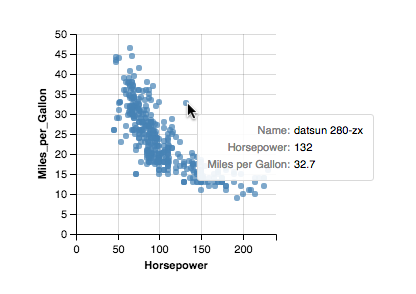

# vgTooltip
A tooltip plugin for Vega-Lite and Vega.




## Author
The development of Vega-Lite Tooltip is led by Zening Qu, with significant help from [Kanit "Ham" Wongsuphasawat](https://twitter.com/kanitw) and [Dominik Moritz](https://twitter.com/domoritz).


## Examples
http://vega.github.io/vega-lite-tooltip/


## Run Instructions
1. In the project folder `vega-lite-tooltip`, type command `npm install`.
2. Then, type `npm start`.
3. In your browser, navigate to `http://localhost:4000/`.


## Creating Your Tooltip
**Step 1** Include the `vgTooltip` library and its dependencies (`d3`, `vega`, `vega-lite`, `vega-embed` and `datalib`) in your HTML `<head>`.

```html
<!-- Dependencies -->
<script src="http://d3js.org/d3.v3.min.js"></script>
<script src="https://vega.github.io/vega/vega.min.js"></script>
<script src="http://vega.github.io/vega-lite/vega-lite.min.js"></script>
<script src="http://vega.github.io/vega-editor/vendor/vega-embed.js" charset="utf-8"></script>
<script src="http://vega.github.io/datalib/datalib.min.js"></script>
<!-- Tooltip Library -->
<script src="vg-tooltip.js" charset="utf-8"></script>
<link rel="stylesheet" type="text/css" href="vg-tooltip.css">
```

**Step 2** In your HTML `<body>`, create a placeholder for your Vega-Lite or Vega visualization. Give the placeholder a unique `id`, which will be used in step 4. For example:

```html
<!-- Placeholder for my Scatter Plot -->
<div id="vis-scatter"></div>
```

**Step 3** In your HTML `<body>`, create a placeholder for the tooltip. Give the placeholder an `id` named `vis-tooltip` so that it can be recognized by our plugin. Assign `class` `vg-tooltip` to the placeholder to use our default CSS style.

```html
<!-- Placeholder for Tooltip -->
<table id="vis-tooltip" class="vg-tooltip"></table>
```

> Tip: Generally speaking you only need one tooltip placeholder per HTML page (even if you have multiple visualizations in that page) because the mouse only points at one thing at a time.

**Step 4** In your JavaScript file, create a Vega-Lite visualization using [`vg.embed`](https://github.com/vega/vega/wiki/Embed-Vega-Web-Components) or create a Vega visualization using [`vg.parse.spec`](https://github.com/vega/vega/wiki/Runtime). For example:

```js
// create a Vega-Lite example using vg.embed
vg.embed("#vis-scatter", embedSpec, function(error, result) {
    // result.view is the Vega View
});
```

or

```js
// create a Vega example using vg.parse.spec
vg.parse.spec(vgSpec, function(error, chart) {
    // view is the Vega View
    var view = chart({el:"#vis-scatter"}).update();
});
```

**Step 5** In step 4 callback function, create your tooltip with [`Vega View`](https://github.com/vega/vega/wiki/Runtime#view-component-api). If you have a Vega-Lite visualization, use `vlTooltip()` to create your tooltip. If you have a Vega visualization, use `vgTooltip()` to create your tooltip. For example:

```js
// create a Vega-Lite example using vg.embed
vg.embed("#vis-scatter", embedSpec, function(error, result) {
    // result.view is the Vega View, vlSpec is the original Vega-Lite spec
    vlTooltip(result.view, vlSpec);
});
```
or
```js
// create a Vega example using vg.parse.spec
vg.parse.spec(vgSpec, function(error, chart) {
    // view is the Vega View
    var view = chart({el:"#vis-scatter"}).update();
    vgTooltip(view);
});
```
Congratulations! Now you should be able to see a tooltip working with your visualization.

## Customizing Your Tooltip
You can customize the look and the content of your tooltip by passing in an optional `options` parameter to `vlTooltip()` or `vgTooltip()`. For example:

```js
// in vg.embed callback
vlTooltip(result.view, vlSpec, options);
```
or
```js
// in vg.parse.spec callback
vgTooltip(view, options);
```

The complete structure of `options` looks like this:

```js
var options = {
  showFields: [{ // specify data fields to be shown in the tooltip
    field: ..., // field name in the dataset
    fieldTitle: ..., // (optional) field title the tooltip should display
    type: 'date' | 'number' | 'string',
    format: timeUnit | string specifier
  }],
  offset: { // x and y offset (in pixels) of the tooltip
    x: 10,
    y: 10
  },
  colorTheme: 'light' | 'dark' // specify a color theme the tooltip should use
}
```

You don't have to provide a fully-structured `options` object to customize your tooltip. In most cases, a partially filled-out `options` object should suffice.

### Customize Fields
By default, tooltip shows all top-level data fields bound to an element. You can use the `options.showFields` array to overwrite this behavior. If the `showFields` array is not empty, only fields in this array will be displayed in the tooltip.

[//]: # (TODO(zening): tooltip fields order: can we recommend which fields should go first and which ones should go later? I feel that the fields that are most frequently changing as the mouse moves, as well as the field that's encoded with color should go first.)

### Customize Tooltip Offset
By default, tooltip is to the bottom right of the cursor (10px right of and 10px below the cursor). You can use `options.offset` to overwrite this.

### Customize Themes
By default, tooltip uses a `light` color theme. You can set `colorTheme` to `dark` if it better matches your visualization. You can also always write your own CSS to overwrite the `.vg-tooltip` style.
