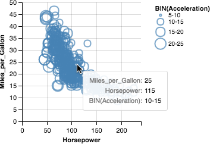
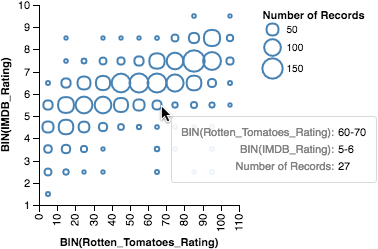
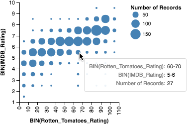

# Pro-tips on Tooltip Design

From the tooltip's perspective, the [`point`](https://vega.github.io/vega-lite/docs/mark.html#point-mark) mark type, when enlarged, can be good for certain visualizations and tricky for some others. For example, when data is dense and there is a lot of overlap among marks, the `point` mark type is a relative good choice because the hollow points overlap less than other mark types. It is also easy for the tooltip to pick up a `point` by hovering on its circumference (see example below).

When the data is sparse however, the `point` mark type becomes less ideal. It's much harder for a user to hover on the thin circumference of a `point` with a sparse data set (see example below).

In these cases, it is better to use the solid mark types such as `circle` or `square`. These mark types are much easier for the tooltip to pick up (see example below).

